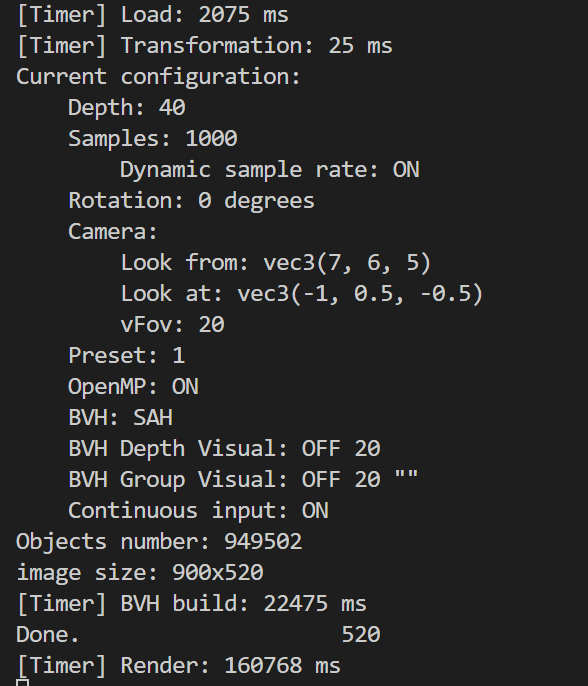

# Ray-Tracing

## Project Overview

Our goal is to implement an optimized ray tracer based on **Ray Tracing in One Weekend** framework [^rtweekend], with:

- **Core optimizations**:
  - BVH construction with surface area heuristic (SAH)
  - Parallel acceleration* via OpenMP

[^rtweekend]: P. Shirley et al. *Ray Tracing in One Weekend*. GitHub, 2020. https://github.com/RayTracing/raytracing.github.io

The room model comes from free3d [^free3d]

[^free3d]: Isometric Room. https://free3d.com/3d-model/isometric-room-362653.html

<table>
  <tr>
    <td></td>
  </tr>
  <tr>
    <td align="center">magic material</td>
  </tr>
</table>

<table>
  <tr>
    <td></td>
    <td></td>
  </tr>
  <tr>
    <td align="center">configuration</td>
    <td align="center">overall</td>
  </tr>
</table>

<table>
  <tr>
    <td></td>
    <td></td>
  </tr>
  <tr>
    <td align="center">bvh tree depth visualization</td>
    <td align="center">bvh tree branch visualization</td>
  </tr>
</table>

---

## Installation

```
sudo apt install -y cmake g++ gdb
sudo apt install libopencv-dev
sudo apt install libeigen3-dev
```

## How to run

```
mkdir build
cd build
cmake .. 
make && ./main -i 0 -sa 1000
```

## Technical Approach

### Base Framework

- Modified [Ray Tracing in One Weekend](https://github.com/RayTracing/raytracing.github.io)  
  
- Key extensions:
  - display image on screen (opencv)
  - OBJ/GLB model loader
  - BVH construction with surface area heuristic (SAH)
  - magic material

### Optimization Pipeline

1. **Pre-processing Stage**:
  - BVH construction with SAH

2. **Ray Tracing Stage**:
  - Parallel ray batches (OpenMP)
  - dynamic sample rate

---

## Implementation Timeline

| Week | Tasks |
|------|-------|
| 1 | Base framework + OBJ loader |
| 2 | Complex models + BVH optimization |
| 3 | Parallel acceleration + interactive controls |

## Magic Material Technical Explanation​​

The magic material is a specialized shader that creates dynamic visual effects by transforming the rendering pipeline. Its core functionality operates through three key mechanisms:

### ​​View-Dependent Projection​​

- Uses a virtual camera system with configurable parameters (position, target, FOV)
- Projects scene geometry onto an internal image plane (800x600 default resolution)
- Creates perspective distortion effects through ray recasting
​
### ​Stochastic Ray Redirection​​

- 10% probability of triggering specular reflection with:
  - Fixed 0.5 fuzz factor
  - Darkened (0.1, 0.1, 0.1) attenuation
- 90% probability of reprojecting through camera system

### ​UV Space Remapping​​

- Converts hit point coordinates to pixel space (i,j)
- Generates new rays through virtual camera matrix
- Maintains energy conservation via uniform (1,1,1) attenuation
