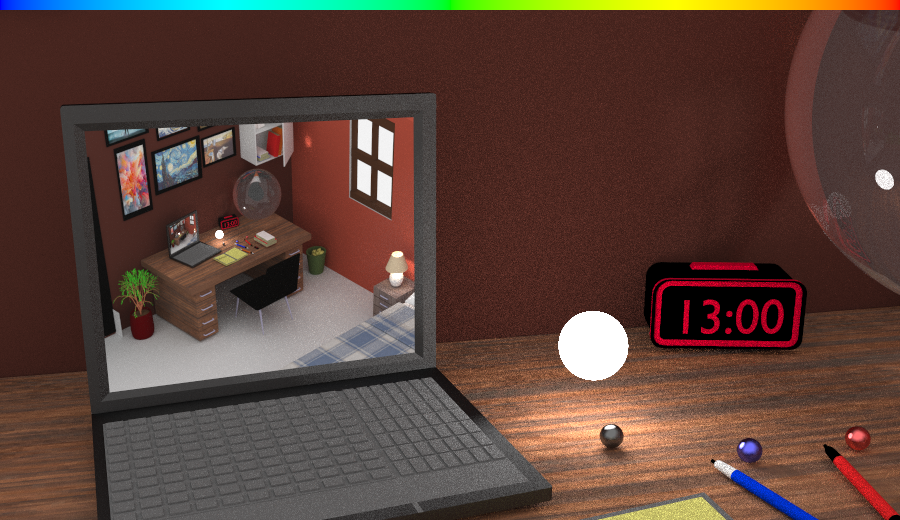

# Ray-Tracing

## Project Overview



Our goal is to implement an optimized ray tracer based on **Ray Tracing in One Weekend** framework [^rtweekend], with:

- **Core optimizations**:
  - BVH construction with surface area heuristic (SAH)
  - Backface culling

- *(OPTIONAL) Parallel acceleration* via OpenMP

[^rtweekend]: P. Shirley et al. *Ray Tracing in One Weekend*. GitHub, 2020. https://github.com/RayTracing/raytracing.github.io

---

## Installation

```
sudo apt install -y cmake g++ gdb
sudo apt install libopencv-dev
sudo apt install libeigen3-dev
```

## How to run

```
mkdir build
cd build
cmake .. -DCMAKE_BUILD_TYPE=Release
make
./task1
```

## Technical Approach

### Base Framework

- **Modified "Ray Tracing in One Weekend"**  
  (https://github.com/RayTracing/raytracing.github.io)
  
- Key extensions:
  - OBJ/GLB model loader
  - BVH construction with surface area heuristic (SAH)
  - PBR material system

### Optimization Pipeline

1. **Pre-processing Stage**:
   - Back-face culling for opaque objects:  
     `Discard if n·d ≥ 0`  
     *(where n is triangle normal, d is ray direction)*
   - BVH construction with SAH

2. **Ray Tracing Stage**:
   - *(OPTIONAL) Parallel ray batches* (OpenMP)

---

## Implementation Timeline

| Week | Tasks |
|------|-------|
| 1 | Base framework + OBJ loader + back-face culling |
| 2 | Complex models + BVH optimization |
| 3 | *(OPTIONAL) Parallel acceleration* + interactive controls |